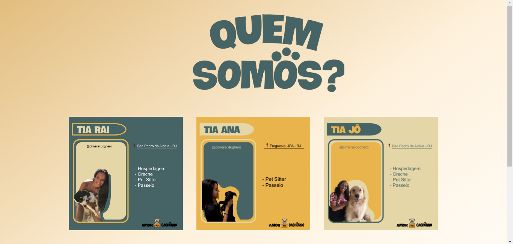
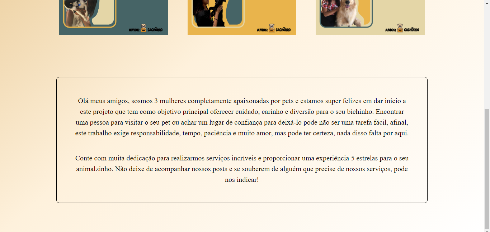
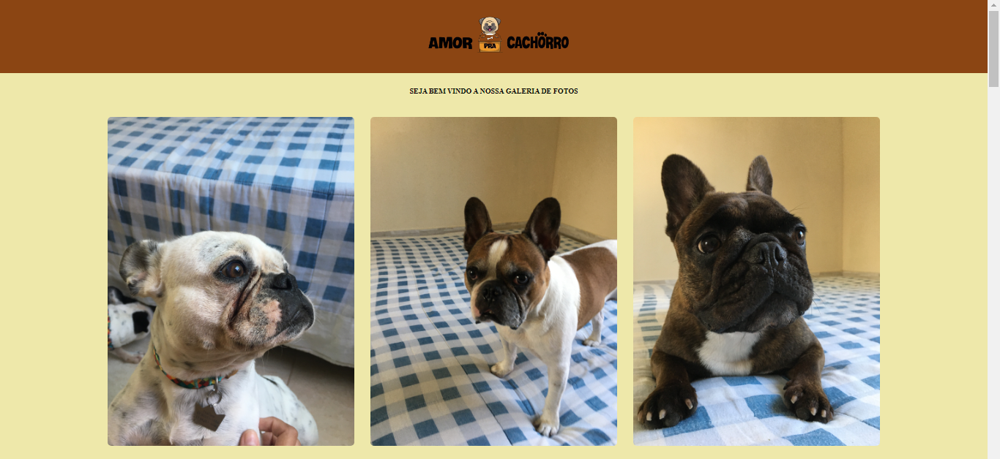
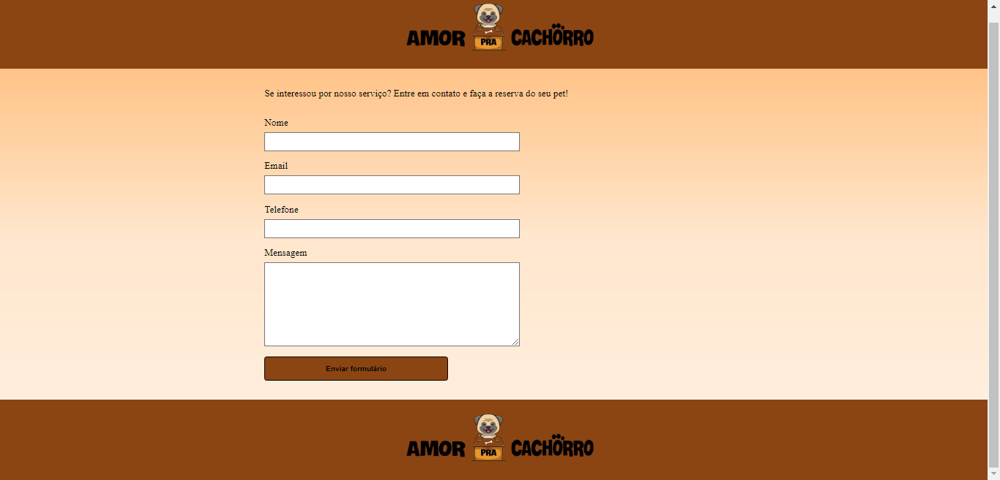

# 📋 Indíce

- [Bem-vindo](#id01)
- [Proposta](#id02)
  - [O desafio](#id02.1)
  - [Objetivo](#id02.2)
- [Meu processo](#id03)
  - [Construção do site](#id03.1)
  - [Aprendizado](#id03.2)
  - [Prosseguimento](#id03.3)
- [Screenshots](#id04)
- [Links](#id05)
- [Tecnologias utilizadas](#id06)
- [Pré-requisitos](#id07)
- [Procedimentos de instalação](#id08)
- [Agradecimentos](#id09)
- [Autora](#id010)

# Bem-vindo! 👋 <a name="id01"></a>

**Landingpage pet.**

Essa foi a criação da minha primeira landing page para adquirir habilidades de codificação criando projetos realistas.

# 🚀 Proposta <a name="id02"></a>

Desafio da mentoria CSV para prática de projetos com o objetivo de adquirir habilidades de codificação.

Escolha de um projeto com o prazo de entrega de 7 dias 
O prazo foi diminuido em 1 dia pelo mentor, portanto, precisou ser realizado em 6 dias.

<br />

Data inicial: 24/07/2022

Data final: 29/07/2022

<br />

## :trophy: O desafio <a name="id02.1"></a>

<br />

Os usuários devem ser capazes de: 

**Página principal**

- Clicar nos links de navegação do cabeçalho "Quem somos?, "Galeria de fotos" e "contato" e serem direcionados para as respectivas páginas  `index.html`,  `galeria.html` e  `contato.html`.  

- Ao passar o mouse sob as listas de serviço, elas irão aumentar seu tamanho. 

- Ao clicar sob as listas de serviço, será direcionado para uma página externa. 

**Página - Quem somos?**

- O usuário deve ser capaz de passar o mouse sob o parágrafo e ele mudará de cor. 

**Página - Galeria de fotos**

- Ao passar pelas fotos cada uma terá destaque ao aumentar de tamanho. 

**Página - contato**

- Preenchimento dos dados com "nome, e-mail, telefone e mensagem".

- Observe que este é um teste de criação de formulário que ainda passará por validação. 

<br />

## :trophy: Objetivo <a name="id02.2"></a>

<br />

- Baseado no curso de HTML e CSS da Alura e no site Barbearia-Alura, tive como objetivo fazer o meu primeiro projeto pessoal para adiquirir conhecimentos nas linguagens de marcação HTML5 e CSS3. 

- Criar uma landingpage para divulgação de serviços na área pet. 

- Iniciar aprendizado em HTML e CSS. 

<br />

# 👩🚀 Meu processo <a name="id03"></a>

<br />

6 dias para concluir o projeto

## :trophy: Construção do site <a name="id03.1"></a>

- Marcação HTML5 semântica
- Propriedades CSS

**A construção deste projeto consistiu na criação de quatro páginas**

1. Criação do arquivo `index.html` e `style.css` e listas de navegação `ul` `li` `a` para redirecionamento para outras páginas. 

2. Criação do aquivo `quemsomos.htm` e `style-quem-somos.css` com informações sobre os serviços e sua localização, assim como imagens e um parágrafo com efeito `hover`

3. Criação do arquivo `galeria.html` de imagens com efeito `hover` 

4. Criação do arquivo `contato.html` e `style-contato` com um formulário de contato. 

Dentro da pasta `/design` encontram-se os designs do projeto. 
O desenho está em formato PNG estático. Usei meu julgamento para estilos como `font-size`, `padding`e `margin`.

## :trophy: Aprendizado <a name="id03.2"></a>

- Criação de `header` e `footer`
- Centralização dos elementos de navegação com `inline-block`   
- Inserção de imagens 
- Efeito `hover`
- Criação de formulário 

## :trophy: Prosseguimento <a name="id03.3"></a>

Novos projetos para aprender o uso do flexbox. 

<br />

# :camera_flash: Screenshots <a name="id04"></a>

<br />

## :desktop_computer: Desktop design









<br />

# :heavy_check_mark: Links <a name="id05"></a>

<br />

- Clique no link para acessar a página: https://raizacirne.github.io/landingpage-pet/

<br />

# 🛠 Tecnologias utilizadas <a name="id06"></a>

<br />

- HTML5
- CSS3

<br />

# ☑️ Pré-requisitos <a name="id07"></a>

<br />

- [x] Editor de código de sua preferência (recomendado VS code)
- [x] Git

<br />

# 📝 Procedimentos de instalação <a name="id08"></a>

<br />

Clone este repositório usando o comando:

```bash
<<<<<<< HEAD
git clone https://github.com/RaizaCirne/site-ada-lovelace.git
=======
git clone https://github.com/RaizaCirne/landingpage-pet.git
>>>>>>> 95eb9e74e1c3bf3becb55e80eeca9d4948a2ee1f
```


Baixar arquivo zip 

Extrir arquivos

Abrir pasta no editor de código.

<br />

# :sunglasses: Agradecimentos <a name="id09"></a>

<br />

Agradeço a Alura por todo o aprendizado que me possibilitou fazer o meu primeiro projeto pessoal. 
Agradeço também ao professor e mentor Pedro Marins que me ensinou a ir além da teoria para colocar todo conhecimento obtido em prática!

<br />

# :sunglasses: Autora <a name="id010"></a>

<br />

- Personal Page - [Raíza Cirne Braz](https://raizacirne.github.io/landingpage-pet/)
- Frontend Mentor - [@RaizaCirne](https://www.frontendmentor.io/profile/RaizaCirne)
- GitHub - [RaizaCirne](https://github.com/RaizaCirne)
- LinkedIn - [Raíza Cirne Braz](https://www.linkedin.com/in/ra%C3%ADzacirne/)

**HTML - CSS** 🚀

