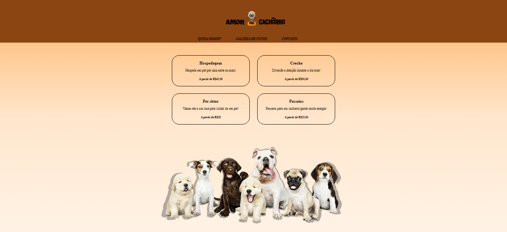

# Landing page para serviços pet 

# Bem-vindo! 👋

Essa foi a criação da minha primeira landing page para adquirir habilidades de codificação criando projetos realistas.

## O projeto

Clique no link para acessar a página: https://raizacirne.github.io/landingpage-pet/

### Objetivo

O objetivo foi criar uma landing page de serviços pet para adquirir conhecimentos nas linguaguens de marcação HTML e CSS. 

Dentro da pasta `/design` encontram-se os designs do projeto. 
Os desenhos estão em formato PNG estático. Usei meu julgamento para estilos como `font-size`, `padding` e `margin`.

# Tecnologias utilizadas 

## Front end

HTML e CSS. 

# Sobre o projeto

**A construção deste projeto consistiu na criação de quatro páginas.**

1. Criação do arquivo `index.html` e do `style.css`como página principal com links clicáveis para os serviços oferecidos de uma página já existente, e o `header` com links clicáveis para os arquivos `quemsomos.html`, `galeria.html` e `contato.html`.
2. Criação do arquivo `quemsomos.html`e `style-quem-somos.css`com informações sobre os serviços e sua localização. 
3. Criação do arquivo `galeria.html` e `style-galeria.css`com a galeria de fotos dos pets. 
4. Criação do arquivo `contato.html` e `style-contato.css` com um formulário de contato para preenchimento com `input`.

**HTML - CSS** 🚀
